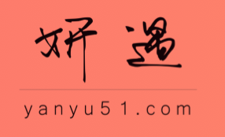

<!-- Banner -->
<section id="banner" class="major">
	

		<header class="major">
		        
			<h1>{{ page.landing-title }}</h1>
		</header>
		

			
{{ site.description }}

			
		

	

</section>

<!-- Main -->

<!-- One -->


<!-- Two -->
<section id="two">
	

		<header class="major">
			<h2>助更多女性变美丽</h2>
		</header>
		

		<ul class="actions">
			<li><a href="landing.html" class="button next">开始变美</a></li>
		</ul>
	

</section>

