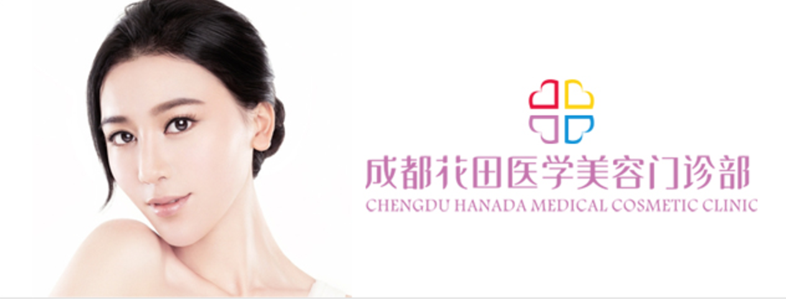

<!-- Banner -->
<!-- Note: The "styleN" class below should match that of the header element. -->
<section id="banner" class="style2">
	

		
			
		
		<header class="major">
			<h1>院方介绍</h1>
		</header>
		

			
{{ page.description }}

		

	

</section>

<!-- Main -->

<!-- One -->

<!-- Two -->
<section id="two" class="spotlights">
	<section>
		
		

			

				<header class="major">
					<h3>成都花田医学美容院</h3>
				</header>
				
成都花田整形美容医院,由资深整形医生创建，专注于中、韩整形技术的研究和创新。率先从韩国引入韩国执业整形医师，以及60多项韩国最新技术并创新运用于临床倾力打造海量真人案例,用效果说话!

				<ul class="actions">
					<li><a href="generic.html" class="button">Learn more</a></li>
				</ul>
			

		

	</section>
	<section>
		
		

			

				<header class="major">
					<h3>成都铜雀台整形美容医院</h3>
				</header>
				
成都铜雀台整形美容医院依托10年品牌沉淀，多家韩国医院战略合作同盟的雄厚实力，以“全科室一线韩国院长覆盖”的运营模式，并坚持以“韩国技术,服务中国”为己任，中韩权威精诚协作

				<ul class="actions">
					<li><a href="generic.html" class="button">Learn more</a></li>
				</ul>
			

		

	</section>

</section>

